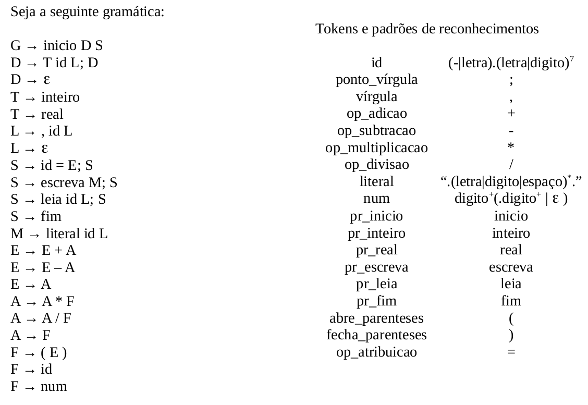

# Trabalho de Compiladores - Analisador Léxico

## Sobre

O objetivo deste trabalho foi construir um analisador léxico que reconheça os `tokens` da Gramática abaixo, de acordo com
seus respectivos padrões de reconhecimento: 



---

## Exemplo

Abaixo, tem-se um exemplo de uma `string` gerada pela gramática:

```
inicio 
inteiro intA, intB; 
real decimalA; 

leia intA, decimalA; 

intB = intA + (intA - 523.123); 

escreva "esse eh o valor do decimalA" decimalA; 

fim
```

---

## Como executar 

Para executar esse analisador, é preciso que tenha-se um compilador C++ instalado na máquina. Além disso, precisa-se do `make` instalado. De preferência, execute esse projeto em um sistema operacional Linux.

No terminal execute os seguintes comandos ignorando o '`$`':

```bash
  # Para compilar
  $ make all

  # Para executar, utilizando o arquivo de entrada: entrada.txt
  $ ./executable

  # Para executar, utilizando o arquivo de entrada criado por você
  $ ./executable nome-do-arquivo

  # Para limpar o que foi criado pelo make
  $ make clean
```

Seguindo esses passos o analisador será executado, e no final ele mostrará os `tokens` reconhecidos.